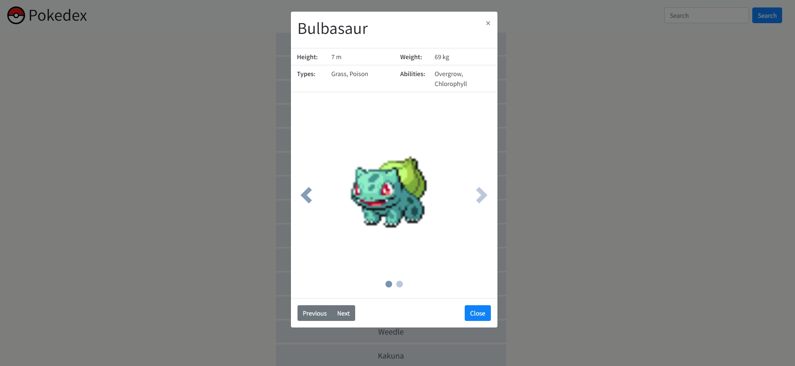

# Pokédex-App

A simple web app displaying Pokémon and their characteristics, built in HTML and Javascript with Bootstrap using the PokeAPI.

## Key Features

Key Features
- Load data from [PokeAPI](https://pokeapi.co/)
- View a list of items (Pokemon)
- On user action (by clicking on a list item), view details for that item
- Simple search function with filter functionality
- Automatic infinite scroll paging (load further items when scrolled to end of page)

### Built with

- JavaScript
- Bootstrap 4.3.1
- JQuery 3.1.1
- HTML
- CSS

## Screenshot

## Links

- Live Site URL: https://lxnhard.github.io/pokedex-app//
